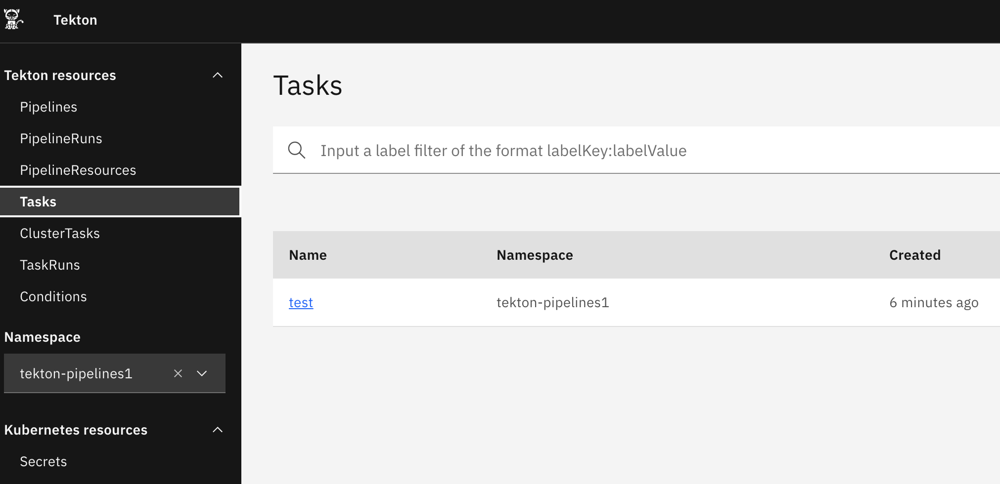
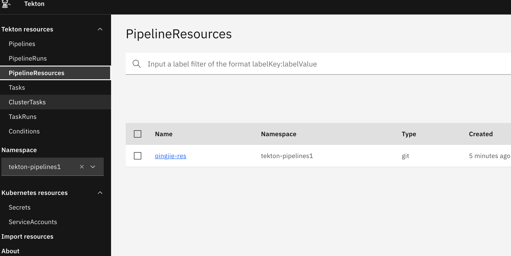
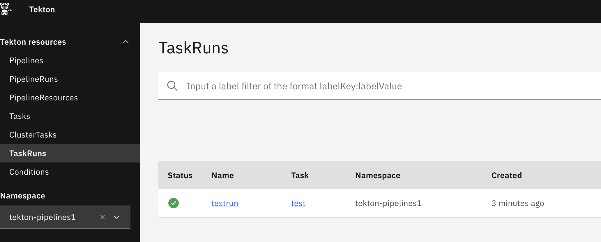

# tekton-demo



---
```
kubectl get secret docker-auth -n tekton-pipelines -o yaml

echo "your_username" | base64 -D
echo "your_password" | base64 -D
```
---
https://github.com/tektoncd/triggers/releases
